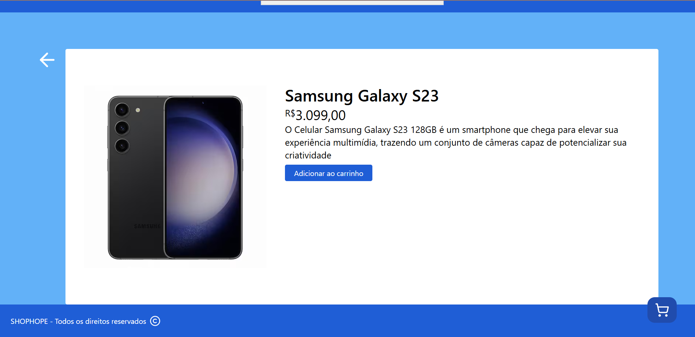
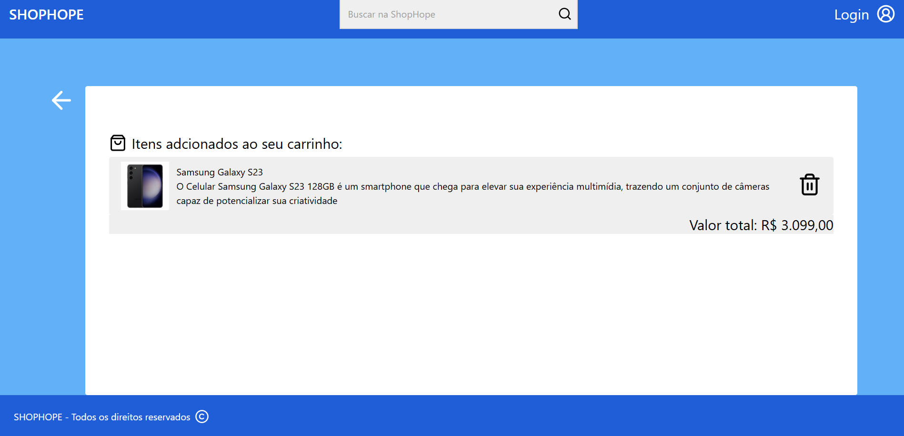
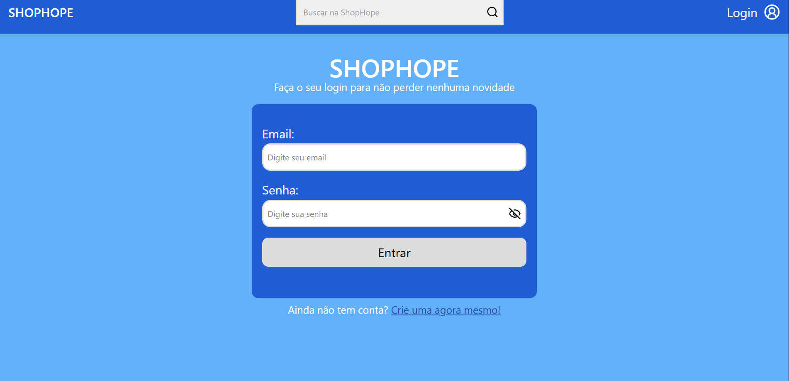
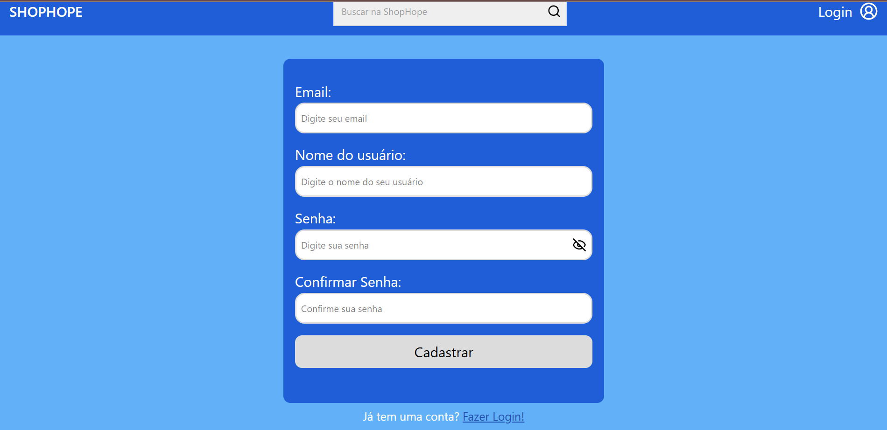

# SHOP-HOPE 🛒

Essa é uma loja online desenvolvido em **React com Typescript**. Aqui você pode encontrar uma variedade de smartphones e periféricos. Cada produto tem uma descrição, preço e uma imagem. Você pode filtrar os produtos pelo nome. Além disso, você pode adicionar produtos ao carrinho. Você também pode se cadastrar na loja e fazer o seu login, deixando seu perfil e consequentemente seu carrinho de compras salvo para quando quiser finalizar a compra posteriormente. Em breve novas funções vão ser adicionadas

## 📌 Funcionalidade
- **Listar Produtos**: Você pode ver todos os produtos disponíveis na loja.

- **Filtrar Produtos**: Você pode filtrar os produtos pelo nome.

- **Adicionar ao Carrinho**: Você pode adicionar produtos ao carrinho.

- **Carrinho**: Você pode ver os produtos adicionados ao carrinho.

- **Login e cadastro**: você cria um usuário e pode fazer o login para finalizar a compra futuramente.


## 🛠️ Tecnologias Utilizadas

- **React**: Biblioteca JavaScript para criar interfaces de usuário.

- **TypeScript**: Linguagem de programação que adiciona tipos estáticos ao JavaScript.

- **Tailwind CSS**: Biblioteca CSS para estilizar a aplicação.

- **React Router**: Biblioteca para gerenciar rotas na aplicação.

- **React-hook-forms**: Biblioteca para facilitar o gerenciamento de formulários, incluindo validação e manipulação de dados

## 📷 Imagens da Aplicação

home


produto



carrinho com produtos


login do usuário


cadastro do usuário


## 🚀 Como executar o projeto

1️⃣ **Clone o repositório**  
Abra o terminal e execute:
```sh
git clone https://github.com/caio1213pgm/shop-hope.git
```

2️⃣ **Acesse o diretório do projeto**
````sh
cd shop-hope
````

3️⃣ **Instale as dependências**
````sh
npm install
````

4️⃣ **Inicie o servidor de desenvolvimento**
````sh
npm run dev
````